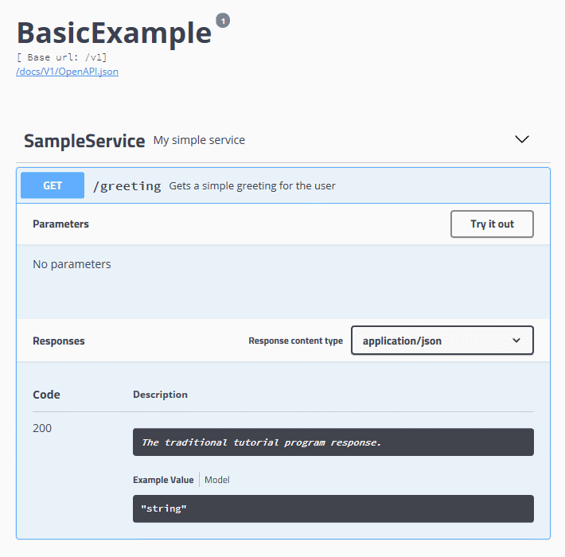

# Crest


[](https://ci.appveyor.com/project/samcragg/crest/branch/master) [](https://coveralls.io/github/samcragg/Crest?branch=master) [](https://sonarcloud.io/dashboard?id=crest) 

## What does it do

In a nutshell, Crest provides a complete framework for routing HTTP requests to
your code based on the HTTP verb and URL, taking care of content negotiation
to/from the methods. It uses configuration over convention, so there are no
steep learning curves to get started with the framework for the first time -
everything just works as expected and things won't break if you start
renaming/moving classes around.

The typical usage for the framework is to create RESTful services. Since there
is no formal specification on what this means, however, the framework reinforces
generally agreed upon best practices (i.e. it has an opinion on what REST means).

## How to use it

The endpoints you want to create are defines by putting attributes on methods
declared in an interface. Since this is your contract with the outside world,
any documentation added here can be exposed as
[OpenAPI](https://www.openapis.org/) data.

```C#
/// <summary>
/// My simple service.
/// </summary>
public interface ISampleService
{
    /// <summary>
    /// Gets a simple greeting for the user.
    /// </summary>
    /// <returns>
    /// The traditional tutorial program response.
    /// </returns>
    [Get("greeting")]
    [AllowAnonymous]
    [Version(1)]
    Task<string> SimpleMessageAsync();
}
```

This produces the following endpoint:



Since the verb is based on the attribute and the URL is passed in to its
constructor, you're free to name the method anything you like. Also, there's no
need to inherit from any base class when implementing the interface, reducing
coupling to the framework and reducing the temptation to interrogate the current
HTTP request.

Note that all endpoints require an authenticated user by default, which you can
opt-out of by applying the `AllowAnonymous` attribute. Since creating the right
API first time is difficult but getting third parties to update their code is
even harder, all endpoints require the `Version` attribute that
specifies from when (and optionally until) the endpoint is available.

## Batteries included

Crest is built for .NET Core 2.1 and the .NET Framework 4.6.1. It is built from
the ground up to be asynchronous and out of the box supports all the essentials
required for building a scalable and easy to maintain service quickly:

+ [Dependency injection](docs/Dependency%20Injection.md) with assembly scanning
  (i.e. it will map your interfaces to their concrete implementation for you).
+ Simple [configuration injection](docs/Configuration.md)
+ [OpenAPI documentation](docs/OpenAPI%20Support.md) of endpoints
+ Versioning of endpoints
+ [Deserializing/serializing](docs/Content%20Negotiation.md) the HTTP
  request/response based on its content type (out of the box JSON, URL form
  encoded data and XML are supported).
+ [Health page](docs/Health.md)
+ [Basic metrics](docs/Metrics.md) for the last 15 minutes
+ [JWT handling](docs/JWT.md)

## Contributing

All contributions are welcome! Take a look at [CONTRIBUTING](CONTRIBUTING.md)
for some tips.

## Code of Conduct

This project has adopted the code of conduct defined by the
[Contributor Covenant](https://www.contributor-covenant.org/) to clarify
expected behaviour in our community. For more information see
[CODE_OF_CONDUCT](CODE_OF_CONDUCT.md).
