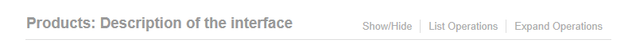

# OpenAPI Support

The framework supports the generation of [OpenAPI](https://www.openapis.org/)
JSON files at compile time, which can then be used as part of a static web page
or can be served by the micro service via the `Crest.OpenApi` package. The
information for the documentation is taken from the routing attributes and XML
documentation on the interfaces via a tool that runs as a post compile step
producing separate files for each version of the API.

## Documentation Generation

To generate the OpenAPI JSON information, first of all make sure the XML
documentation file is generated when building the project containing the web API
interfaces (either by the Properties page in Visual Studio or editing the
`.csproj` to include
`<GenerateDocumentationFile>true</GenerateDocumentationFile>`). You'll then
need to edit the `.csproj` project file to add a reference to the
`Crest.OpenApi.Generator` NuGet tool package (this needs to be done via editing
the project file, as the NuGet package manager/command line doesn't cope with
CLI tools):

    <PropertyGroup>
      ...
      <GenerateDocumentationFile>true</GenerateDocumentationFile>
    </PropertyGroup>

    <ItemGroup>
      ...
      <DotNetCliToolReference Include="Crest.OpenApi.Generator" Version="0.1.0" />
    </ItemGroup>

You can now run the tool from the command line to generate the documentation:

    project_directory> dotnet crest-openapi bin\Debug\netcoreapp1.0\MyApi.dll

This needs to be ran every time the documentation changes. To automate this so
that it is generated with every build, edit the `.csproj` file to include the
following target:

    <Target Name="GenerateOpenApi" BeforeTargets="Build">
      <Exec Command="dotnet crest-openapi $(TargetPath)" WorkingDirectory="$(ProjectDir)" />
    </Target>

## Hosting

The generated JSON files can be used with any tool that can read OpenAPI files,
such as the [Swagger Editor](https://swagger.io/swagger-editor/) or the
[Swagger UI](https://swagger.io/swagger-ui/) tools. Alternatively, the latter is
packaged up so that it can be hosted directly from the host project by
including the `Crest.OpenApi` package and then navigating to
`http://base_url/docs`.

## OpenAPI Document Information

The generated file will follow the
[version 2.0](https://github.com/OAI/OpenAPI-Specification/blob/master/versions/2.0.md))
specification. The information (i.e. `infoObject`) will contain the details from
the following assembly attributes:

    [assembly: AssemblyTitle("Title")]
    [assembly: AssemblyDescription("Description")]
    [assembly: AssemblyMetadata("License", "License name")]
    [assembly: AssemblyMetadata("LicenseUrl", "http://www.example.com")]

Although none of the attributes are required, if the assembly title attribute is
not specified, the name of the assembly will be used. Also, if the license URL
is specified then the license must also be there but you can just specify the
license without the URL.

## Tags

When using the framework all routes are defined inside interfaces, allowing
routes to be naturally grouped together by functionality. To group the paths
together in the documentation, all methods defined in an interface are tagged
with the same tag, allowing them to appear grouped together in the generated
documentation. The name and description of the tag comes from the interface name
(minus the `I` prefix) and summary XML documentation.

Alternatively, the `Description` attribute can be applied to the interface to
customise the name of the generated tag (note the
[`DisplayName`](https://msdn.microsoft.com/en-us/library/system.componentmodel.displaynameattribute.aspx)
attribute isn't allowed on interfaces, hence the slightly obscure use of this one):

    /// 

    /// Description of the interface.
    /// 

    [Description("Products")]
    public interface IUserProducts
    {
    }

This would generate something looking like this (note if the `Description`
attribute was not specified, the tag would be named `UserProducts`):

